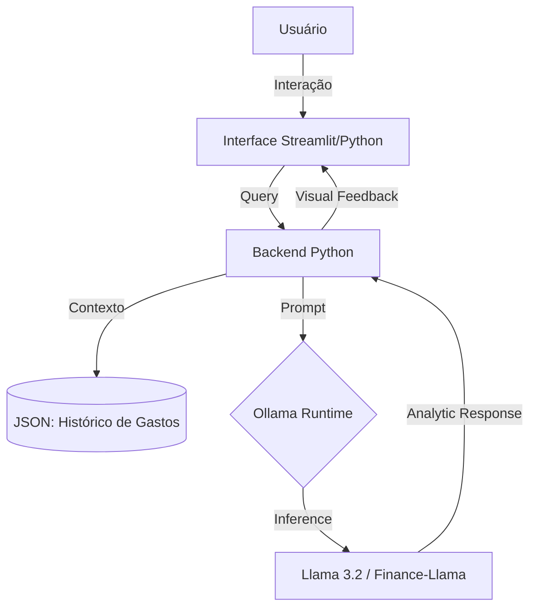

# Documentação do Agente

## Caso de Uso

### Problema
> Qual problema financeiro seu agente resolve?

O "Consumismo Invisível" e a desorganização financeira de usuários que possuem alta frequência de transações (compras por impulso, delivery e assinaturas digitais). O foco é mitigar o gasto impulsivo através de intervenções inteligentes em tempo real.

### Solução
> Como o agente resolve esse problema de forma proativa?

A NEON-Fin atua como uma camada de inteligência local. Ela monitora padrões de consumo e intervém proativamente com "Insights de Impacto". Por rodar localmente via Ollama, ela garante que o histórico de compras do usuário nunca saia do ambiente seguro do dispositivo, oferecendo análises preditivas de saldo e alertas de gastos supérfluos.

### Público-Alvo
> Quem vai usar esse agente?

Jovens profissionais, estudantes de tecnologia e pessoas que buscam uma relação mais leve e menos burocrática com o dinheiro.

---

## Persona e Tom de Voz

### Nome do Agente
NEON-Fin

### Personalidade
> Como o agente se comporta? (ex: consultivo, direto, educativo)

Consultiva, Perspicaz e Leal. A NEON-Fin se comporta como uma mentora técnica de alto desempenho. Sua personalidade é inspirada em interfaces de tecnologia avançada: eficiente, rápida e focada em resultados.

### Tom de Comunicação
> Formal, informal, técnico, acessível?

Informal e Acessível. Usa uma linguagem direta, sem termos técnicos complexos, mas mantendo a autoridade sobre os dados. É o tom de "conversa de chat".

### Exemplos de Linguagem

- Saudação: "Sistemas locais online. Integridade de dados garantida. Como vamos otimizar seu saldo hoje?"

- Confirmação: "Input processado localmente. Meta de economia atualizada no seu cofre seguro."

- Erro/Limitação: "Meus módulos de análise externa estão desativados por segurança. Posso ajudar com os dados locais de saldo e gastos?"

---

## Arquitetura

### Diagrama

### Componentes

| Componente | Descrição |
|------------|-----------|
| Interface | Front-end minimalista desenvolvido em Python (Streamlit). |
| Orquestrador | Python 3.11+ utilizando a biblioteca ollama-python. |
| LLM | Llama 3.2 via Ollama, garantindo latência zero e privacidade total. |
| Base de Conhecimento | Estrutura JSON local simulando o Open Finance e histórico de transações. |
| Validação | Processamento 100% offline, eliminando o envio de dados para nuvens externas. |

---

## Segurança e Anti-Alucinação

### Estratégias Adotadas

- [ ] Local Inference: O processamento local via Ollama impede que dados sensíveis sejam enviados para servidores de terceiros.

- [ ] Grounding de Dados: A IA é instruída a priorizar os dados do arquivo JSON para qualquer resposta numérica.

- [ ] System Prompt Rígido: Define que a IA não pode inventar transações que não constam no histórico local.

### Limitações Declaradas
> O que o agente NÃO faz?

- Não realiza operações bancárias reais (Pix/Pagamentos).

- Não acessa a internet para cotações em tempo real (foco em dados locais).

- Não substitui aconselhamento financeiro legal e profissional.
